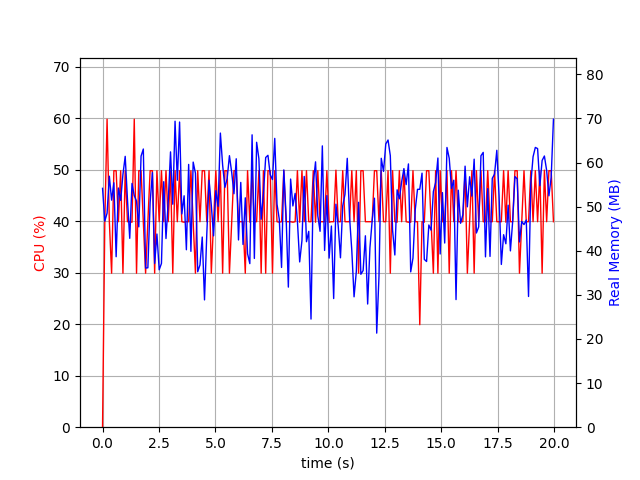

# IPC Performance Benchmarks
This repository is designed to evaluate the performance of various IPC techniques for transferring image and point cloud data between a publisher and subscriber. It contains a series of tests that measure the efficiency, resource utilization, latency, throughput, and serialization/deserialization time of different IPC methods, making it easy for you to determine which one best suits your needs.

## Overview
In this repository, we test several IPC techniques for transporting image and point cloud data across processes. The benchmarking suite evaluates each method using images of varying sizes: [480, 640], [1280, 960], [1800, 1200], and [2100, 1500], and point cloud data with 16k points in a single row. For each test, we measure the CPU and memory utilization, latency, throughput, and serialization/deserialization time to provide a comprehensive assessment of the method's performance.

The primary goal of this repository is to assist developers in choosing the most suitable IPC method for their image and point cloud data transportation needs.

## Updates
* Added point cloud data benchmarking (16k points in a single row)
* Included latency, throughput, and serialization/deserialization time measurement

## Benchmarking Metrics
1. CPU Utilization
2. Memory Utilization
3. Latency
4. Throughput
5. Serialization time
6. Deserialization time

## CPU Core Isolation for Accurate Benchmarking
CPU cores are often shared by multiple processes and threads, which can lead to interference and fluctuations in performance. Isolating CPU cores ensures that the benchmarking process runs on a dedicated core without interruptions from other processes. This provides a stable and controlled environment for accurate measurements.

Taskset is a Linux command-line utility that allows you to assign specific CPU cores to a given process. By utilizing taskset, you can ensure that the benchmark process runs on the isolated core, further enhancing the accuracy and reliability of the IPC performance benchmarks.

### Isolate CPUs
```bash
sudo vim /etc/default/grub
```
```bash
GRUB_CMDLINE_LINUX="isolcpus=0,1"
```
```bash
# Update the boot arg
sudo update-grub2

# Reboot the Machine
```

```bash
# Next boot cycle
# check isolated CPUs
cat /sys/devices/system/cpu/isolated
0-1
cat /sys/devices/system/cpu/present
0-19
```

## Getting Started
```bash
git clone https://github.com/nullbyte91/IPC-Performance-Benchmarks.git
cd IPC-Performance-Benchmarks/
```

```bash
# Compile and Run redis_msgpack
mkdir -p redis_msgpack/build/ && cd redis_msgpack/build/ && cmake .. && make

# Terminal 1
time taskset -c 1 ./redis_subscriber

# Terminal 2
time taskset -c 0 ./redis_publisher

# Terminal 3
cd IPC-Performance-Benchmarks/benchmark/
python3 main.py --pid {process_ID} --log IPC_PUB_logfile --plot IPC_PUB.png --duration 30 --interval 0.1

# Terminal 4
cd IPC-Performance-Benchmarks/benchmark/
python3 main.py --pid {process_ID} --log IPC_SUB_logfile --plot IPC_SUB.png --duration 30 --interval 0.1
```

```bash
# Compile and Run redis_protobuf
mkdir -p redis_protobuf/build/ && cd redis_protobuf/build/ && cmake .. && make

# Terminal 1
time taskset -c 1 ./redis_subscriber

# Terminal 2
time taskset -c 0 ./redis_publisher

# Terminal 3
cd IPC-Performance-Benchmarks/benchmark/
python3 main.py --pid {process_ID} --log IPC_PUB_logfile --plot IPC_PUB.png --duration 30 --interval 0.1

# Terminal 4
cd IPC-Performance-Benchmarks/benchmark/
python3 main.py --pid {process_ID} --log IPC_SUB_logfile --plot IPC_SUB.png --duration 30 --interval 0.1
```


```bash
# Compile and Run ROS2
source /opt/ros/foxy/setup.zsh
cd ROS2/ && colcon build

# Terminal 1
time taskset -c 0 ros2 run ros2_pub_sub test_image_pub

# Terminal 2
time taskset -c 1 ros2 run ros2_pub_sub test_image_sub

# Terminal 3
cd IPC-Performance-Benchmarks/benchmark/
python3 main.py --pid {process_ID} --log IPC_PUB_logfile --plot IPC_PUB.png --duration 30 --interval 0.1

# Terminal 4
cd IPC-Performance-Benchmarks/benchmark/
python3 main.py --pid {process_ID} --log IPC_SUB_logfile --plot IPC_SUB.png --duration 30 --interval 0.1
```

```bash
# Compile and Run zmq
mkdir -p zmq_msgpack/build/ && cd zmq_msgpack/build/ && cmake .. && make

# Terminal 1
time taskset -c 1 ./zmq_publisher

# Terminal 2
time taskset -c 0 ./zmq_subscriber

# Terminal 3
cd IPC-Performance-Benchmarks/benchmark/
python3 main.py --pid {process_ID} --log IPC_PUB_logfile --plot IPC_PUB.png --duration 30 --interval 0.1

# Terminal 4
cd IPC-Performance-Benchmarks/benchmark/
python3 main.py --pid {process_ID} --log IPC_SUB_logfile --plot IPC_SUB.png --duration 30 --interval 0.1
```

## Result

Publisher | Subscriber
:-----: | :------:
gRPC
 | 
redis_msgpack
 | 
redis_protobuf
 | 
ROS2 - Point Cloud
 | 
ROS2 - Image
 | 
RESTAPI
 | 
zeromq
 | 

|Middlware/Message | Data Type | Type|Throughput(msgs/sec) | Latency(ns) | Ser/Deser(ns) |CPU Usage(%)  | Memory Usage(MB)  | Licensing  |
|---|---|---|---|---|---|---|----|----|
|gRPC   | Image  | Publisher |10000/50 = 200| 2.49048 | 1.83562 |73  | 55  |   |   |
|   |   | Subscriber  |   | |0.000908188 | 42  | 49  |   |
|ROS2  | Image  |  Publisher | 10000/26 = 384  | 1991 | 0.830270 |99  | 4787  |   | 
|   |   | Subscriber  |   | | 0.00153| 46  |  290 |   | 
|Redis -Msgpack   | Image  | Publisher  | 10000/142  = 70 | 16.4856 | 2.33652 | 55  | 54  |   |
|   |   | Subscriber  |   | | 2.74652| 27  |  25 |   |
|Redis - Protobuf  | Image  | Publisher  | 10000/121 = 82 |  | 3.96685   |  25 | 70| |
|   |   | Subscriber  |   | | 3.27797|   |   |   |
|RESTAPI -JSON  | Image  | Publisher  | 10000/420 = 23 | 12.5059 | 5.39855   | 25  | 70| |
|   |   | Subscriber  |   | |22.5728|  51 |  23 |   |
|zmq -Msgpack | Image  | Publisher  | 10000/45 = 222 | 3.11884 | 2.83907   | 84  | 41| |
|   |   | Subscriber  |   | |0.893189|  30 |  30 |   |

Note: Redis Mspack Pointcloud passing has some issue.

## Installation
```bash
# Install msgpack
sudo apt-get install libmsgpack-dev 
```

### gRPC
```bash
git clone --recurse-submodules -b v1.53.0 --depth 1 --shallow-submodules https://github.com/grpc/grpc
cd grpc
mkdir -p cmake/build
pushd cmake/build
cmake -DgRPC_INSTALL=ON \
      -DgRPC_BUILD_TESTS=OFF \
      ../..
make -j 4
sudo make install
$ popd

# Compilation use C++ 14
cmake -DCMAKE_CXX_STANDARD=14 ..
```
### Redis and Redis C++
```bash
sudo apt install redis-server
sudo systemctl status redis-server
sudo apt install redis-tools

# Test redis server by ping
redis-cli ping # PONG output

git clone https://github.com/redis/hiredis.git
cd hiredis/
mkdir build && cd build/
cmake ..
sudo make install

git clone https://github.com/sewenew/redis-plus-plus.git
cd redis-plus-plus/
mkdir build && cd build/
cmake ..
sudo make install

sudo ldconfig
```
### zeroMQ and cppzmq
```bash
# Install libzmq
wget https://github.com/zeromq/libzmq/archive/refs/tags/v4.3.4.tar.gz
tar -xvf v4.3.4.tar.gz
cd libzmq-4.3.4/
mkdir build
cd build
cmake ..
make -j12
sudo make install
sudo ldconfig

# Install cppzmq
git clone https://github.com/zeromq/cppzmq.git
cd cppzmq/
mkdir build
cd build/
cmake .. -DENABLE_DRAFTS=OFF
sudo make install
sudo ldconfig
```

```bash
sudo apt install -y build-essential autoconf libtool pkg-config
git clone --recurse-submodules -b v1.34.1 https://github.com/grpc/grpc
cd grpc
sudo apt install curl gnupg

curl -fsSL https://bazel.build/bazel-release.pub.gpg | gpg --dearmor > bazel.gpg
sudo mv bazel.gpg /etc/apt/trusted.gpg.d/

echo "deb [arch=amd64] https://storage.googleapis.com/bazel-apt stable jdk1.8" \\n| sudo tee /etc/apt/sources.list.d/bazel.list
sudo apt update && sudo apt install bazel
sudo apt update && sudo apt full-upgrade
sudo apt install openjdk-11-jdk

bazel build :all

mkdir -p cmake/build/
cd cmake/build/
cmake ../../
make -j12 
sudo make install
```

### RESTAPI & JSON
```bash
git clone https://github.com/yhirose/cpp-httplib.git
cd cpp-httplib/
mkdir build/
cd build/
sudo make install

git clone https://github.com/nlohmann/json.git
cd json/
mkdir build/
cd build/
sudo make install

```
```bash
# CORBA
omniidl -bcxx ImageTransfer.idl
```
## License
This repository is released under the MIT License.

